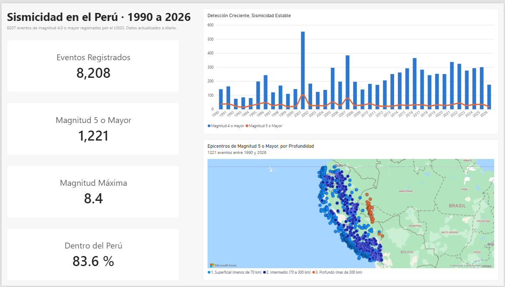
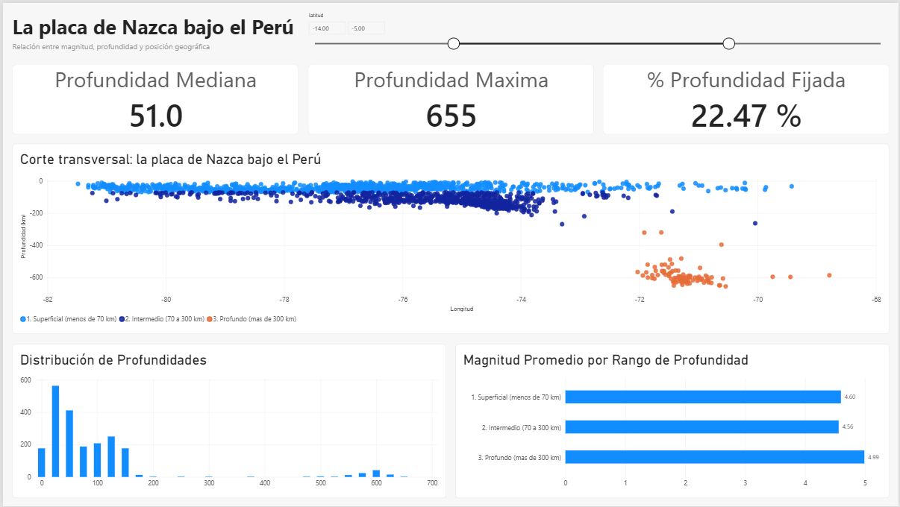
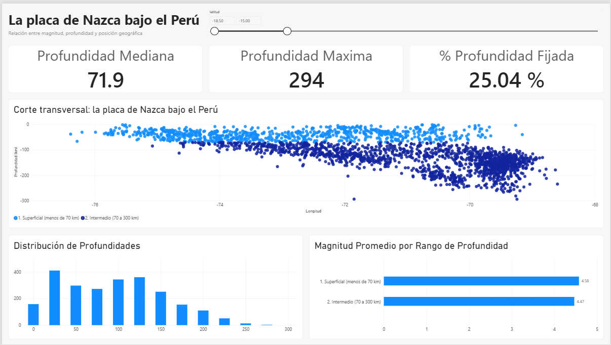
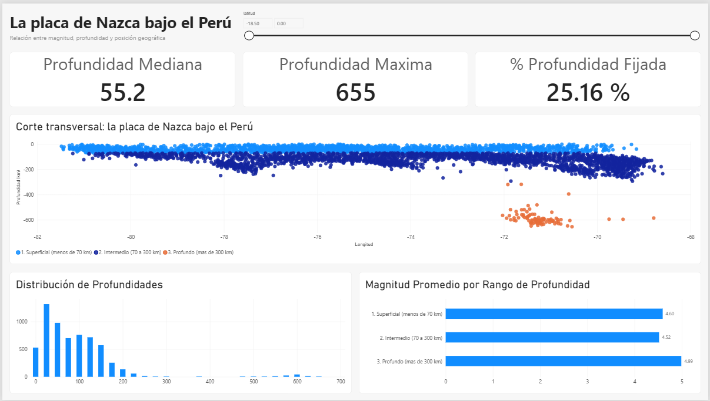
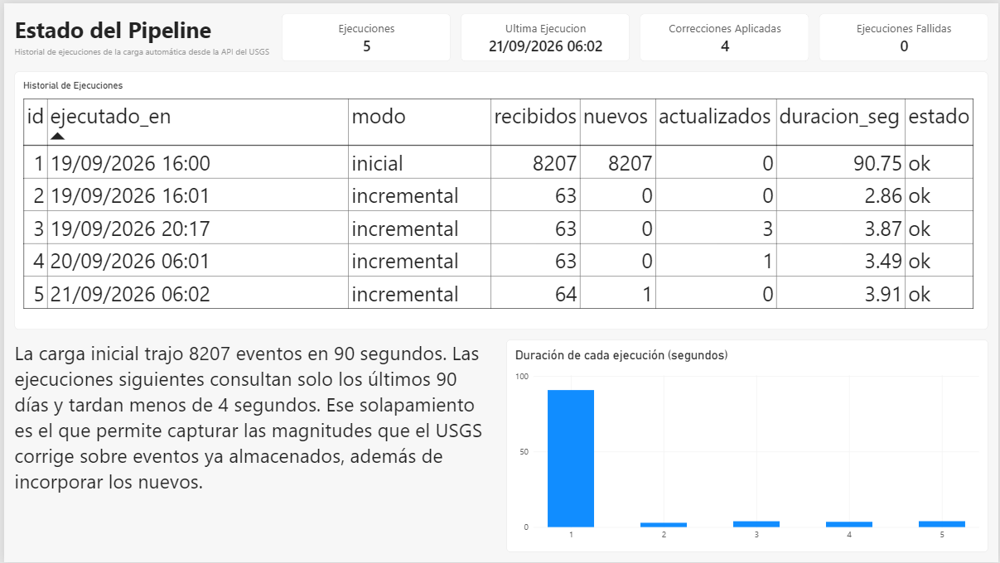

# Monitor de Sismicidad en el Perú



Pipeline automatizado que consulta a diario la API del Servicio Geológico de Estados Unidos,
almacena los sismos del territorio peruano en PostgreSQL y los analiza en Power BI. La carga
es incremental e idempotente: puede ejecutarse cien veces sin duplicar un registro, y captura
las correcciones que el USGS aplica sobre eventos que ya tenía guardados.

Corre solo, todos los días a las 06:00 hora de Lima, en los servidores de GitHub.

## La fuente

| | |
|---|---|
| Servicio | API FDSN del USGS (`earthquake.usgs.gov/fdsnws/event/1/query`) |
| Formato | GeoJSON |
| Cobertura | Rectángulo de latitud -18.5 a 0 y longitud -81.5 a -68.5 |
| Umbral | Magnitud 4.0 o mayor |
| Periodo | Desde enero de 1990 hasta hoy |
| Volumen | 8207 eventos en la carga inicial del 19 de setiembre de 2026, creciendo a diario |

El GeoJSON reparte los datos en dos niveles y tiene tres particularidades que hay que resolver
antes de poder trabajarlo: la profundidad no está en `properties` sino como tercer elemento de
`coordinates`, después de longitud y latitud; el campo `time` viene en milisegundos desde 1970
en UTC, y convertirlo sin declarar la zona desplaza todos los eventos cinco horas; y el campo
`mag` puede llegar nulo en eventos preliminares.

## Arquitectura

```
API del USGS
     │
     ├── src/api.py         consulta con reintentos y normaliza el GeoJSON
     │
     ├── src/ingesta.py     decide el rango, inserta o actualiza, registra la corrida
     │
     ├── PostgreSQL         tablas sismo e ingesta_log, alojadas en Neon
     │
     └── Power BI           tres páginas de análisis

.github/workflows/ingesta.yml   ejecuta el pipeline cada día a las 11:00 UTC
```

## Estructura del repositorio

```
monitor-sismico-peru/
├── .github/workflows/
│   └── ingesta.yml                 flujo programado de GitHub Actions
├── docs/
│   ├── 01_panorama.png
│   ├── 02_profundidad.png
│   ├── 03_corte_centro.png
│   ├── 04_corte_sur.png
│   ├── 05_pipeline.png
│   ├── monitor_sismico_peru.pbix
│   └── monitor_sismico_peru.pdf
├── notebooks/
│   └── 01_exploracion_api.ipynb    exploración inicial y conclusiones
├── sql/
│   ├── 01_schema.sql               tablas e índices
│   └── 02_validacion.sql           conteos, rangos, nulos y duplicados
├── src/
│   ├── api.py
│   └── ingesta.py
├── .env.example
├── requirements.txt                entorno completo de desarrollo
└── requirements-ingesta.txt        solo lo que el pipeline necesita para correr
```

## Cómo reproducirlo

```bash
git clone https://github.com/Gabriel250604/monitor-sismico-peru.git
cd monitor-sismico-peru

python -m venv .venv
.venv\Scripts\activate
pip install -r requirements.txt

copy .env.example .env
```

Completar el `.env` con los datos de conexión. Si se usa una base en la nube basta con
`DATABASE_URL`; para una base local, las variables `DB_HOST` y siguientes.

```bash
psql "$DATABASE_URL" -f sql/01_schema.sql
python src/ingesta.py
psql "$DATABASE_URL" -f sql/02_validacion.sql
```

La primera ejecución detecta que la tabla está vacía y trae el histórico completo por tramos
anuales, con una pausa entre cada uno. Tarda alrededor de 90 segundos. Las siguientes solo
consultan la ventana reciente y terminan en menos de cuatro.

## El modelo

```
sismo
  id_usgs            VARCHAR  PRIMARY KEY
  fecha_utc          TIMESTAMPTZ
  fecha_local        TIMESTAMP
  anio               SMALLINT
  magnitud           NUMERIC
  tipo_magnitud      VARCHAR
  magnitud_momento   BOOLEAN
  profundidad_km     NUMERIC
  profundidad_fijada BOOLEAN
  latitud            NUMERIC
  longitud           NUMERIC
  lugar              TEXT
  pais               VARCHAR
  significancia      INTEGER
  tsunami            SMALLINT
  estado             VARCHAR
  actualizado_utc    TIMESTAMPTZ
  cargado_en         TIMESTAMPTZ

ingesta_log
  id, ejecutado_en, modo, rango_desde, rango_hasta,
  recibidos, nuevos, actualizados, duracion_seg, estado, mensaje
```

La tabla de log no es decorativa. Es la que permite responder cuándo corrió el pipeline por
última vez, si alguna ejecución falló, cuántos eventos entran por semana y cuántas correcciones
llegaron. Sin ella el proceso sería una caja negra, y además da material para una página entera
del tablero.

## Decisiones

### Por qué magnitud 4.0 y no menos

Por debajo de 4.0 la cobertura de la red mundial en el Perú deja de ser homogénea: los eventos
pequeños aparecen o no según la densidad de estaciones cercanas, que cambió mucho en 36 años.
Con umbral 4.0 el conjunto es comparable en el espacio, aunque no del todo en el tiempo, como
se explica en el primer hallazgo.

### Por qué un rectángulo y no la frontera del Perú

La API filtra por coordenadas, no por polígonos administrativos. Trazar la frontera real
exigiría cruzar cada epicentro contra un shapefile, y el beneficio no compensa: el rectángulo
captura toda la sismicidad peruana y el país se identifica después, a partir del texto del
campo `place`. De los 8207 eventos iniciales, 6864 son del Perú y 1343 de Ecuador, Brasil,
Bolivia y Chile. Se almacenan todos y el filtro se aplica en el análisis.

### Por qué el solapamiento de 90 días

El USGS no publica un evento y lo da por cerrado: lo revisa durante semanas. De los 251 eventos
del último año, el 79.7% fue modificado después de 30 días de ocurrido, con una mediana de 76
días y un máximo de 233. Si la carga incremental pidiera solo lo posterior al último evento
guardado, la base se quedaría con las magnitudes preliminares para siempre.

La ventana de 90 días cubre la gran mayoría de esas revisiones. Se combina con
`INSERT ... ON CONFLICT (id_usgs) DO UPDATE ... WHERE sismo.actualizado_utc < EXCLUDED.actualizado_utc`,
que actualiza solo los registros que realmente cambiaron y deja intactos los demás. Por eso dos
ejecuciones seguidas reportan cero nuevos y cero actualizados aunque reciban decenas de eventos.

### Qué pasa si la API no responde

Cada consulta tiene un tiempo límite de 120 segundos y hasta cuatro intentos, con una pausa que
se duplica en cada reintento. Si los cuatro fallan, el script aborta, revierte la transacción y
escribe una fila en `ingesta_log` con estado `error` y el mensaje. La ejecución siguiente
retoma desde donde quedó, porque el rango se calcula a partir de lo que hay en la base y no de
un registro externo.

### Qué pasa si dos ejecuciones se traslapan

Nada. Cada una abre su propia transacción y la llave primaria es el identificador del USGS, así
que el peor caso es que la segunda no encuentre nada nuevo que hacer.

## Hallazgos

### La detección creció; la sismicidad no

El conteo anual de eventos de magnitud 4 o mayor pasa de unos 80 a comienzos de los noventa a
cerca de 300 en los últimos años. Ese crecimiento no es sísmico sino instrumental.

La prueba está en restringir el conteo a magnitud 5 o mayor: ahí la cifra se mantiene entre 15
y 48 eventos por año durante los 36 años, sin tendencia. La red siempre detectó los sismos
medianos; lo que aumentó es su capacidad de registrar los pequeños. Por eso el análisis de
tendencia temporal se hace sobre M5+ y el conjunto completo se reserva para la distribución
espacial y de profundidad.

Los dos picos que rompen la serie, 2001 con 553 eventos y 2007 con 384, corresponden a las
réplicas del sismo de Atico del 23 de junio de 2001, magnitud 8.4, y del de Cañete del 15 de
agosto de 2007, magnitud 8.0. Son reales y se conservan.

### La placa de Nazca cambia de geometría a lo largo del país

Al graficar longitud contra profundidad se dibuja sola la zona donde la placa oceánica se hunde
bajo la continental. Y al separar por latitud aparecen dos comportamientos distintos.

**Centro y norte, latitud -14 a -5**



La banda de sismicidad intermedia se mantiene plana entre 100 y 130 km de profundidad desde la
longitud -80 hasta la -74, unos 650 km de recorrido horizontal sin descender. Después se
interrumpe: no hay un solo evento entre 200 y 400 km. Y reaparece un racimo aislado entre 550 y
650 km cerca de la frontera con Brasil. La profundidad mediana de este tramo es 51 km y la
máxima 655 km.

**Sur, latitud -18.5 a -15**



Una diagonal continua que baja desde la superficie hasta los 200 km, sin tramo plano y sin
interrupciones. La profundidad mediana es 71.9 km y la máxima **294 km**: en 36 años de
registro, el sur del Perú no tiene ni un solo evento de más de 300 km.

La diferencia entre ambos cortes es la firma de la subducción plana, el tramo donde la placa
viaja casi horizontal bajo el continente antes de volver a hundirse, frente a la subducción de
ángulo normal del sur.

### Una cuarta parte de las profundidades no son mediciones



El 25.2% de los registros tiene la profundidad en uno de cinco valores que se repiten: 33 km
aparece 1057 veces, 10 km aparece 654, 35 km aparece 295, más 100 y 150 km. No son mediciones
sino valores por defecto que el USGS asigna cuando la red no logra resolver la profundidad.
Afecta incluso al sismo de Atico de magnitud 8.4, que figura con 33.00 exactos.

Esos registros se marcan con `profundidad_fijada` y se excluyen de los gráficos de profundidad.
Sin ese filtro, el corte transversal mostraría cinco líneas horizontales perfectas que serían
lo más visible del gráfico y no significarían nada.

### Las escalas de magnitud no son intercambiables

En los datos aparecen diez escalas distintas. `mb` concentra 7028 de los 8207 registros y su
valor máximo en todo el periodo es 6.1: ni uno solo la supera. En cambio `mww`, con apenas 326
registros, llega a 8.4. No es que no hubiera sismos grandes medidos con `mb`; es que esa escala
se satura y deja de crecer.

Se conserva `tipo_magnitud` como atributo y se marca con `magnitud_momento` el 12% de registros
medidos en escala de momento, que son los comparables entre sí para eventos grandes.

### El catálogo del USGS se reescribe hacia atrás

La diferencia entre el campo `updated` y el momento del evento llega a 13117 días, casi 36
años. El USGS no solo corrige eventos recientes: reprocesa el catálogo histórico completo.
Ningún solapamiento razonable cubre eso, así que el diseño lo asume: la ventana de 90 días
atiende las revisiones recientes y queda pendiente un refresco total periódico para el resto.

## Limitaciones

**El rectángulo no es el Perú.** Incluye mar abierto y porciones de Ecuador, Brasil, Bolivia y
Chile. El campo `pais` se deriva del texto de `place`, que es una descripción redactada por el
USGS y no un dato administrativo. Un evento quedó sin país identificado.

**El 25% de las profundidades son valores por defecto.** Están marcadas y se excluyen del
análisis de profundidad, pero eso significa que ese análisis trabaja con tres cuartas partes
del conjunto.

**Los sismos profundos parecen más fuertes de lo que son.** El promedio de magnitud sube de
4.52 en el rango intermedio a 4.99 en el profundo. La lectura correcta no es que los sismos
profundos sean mayores, sino que un evento pequeño a 600 km de profundidad llega muy debilitado
a la superficie y muchas veces no se detecta. Lo que se ve es el sesgo de detección, no la
física.

**La comparación temporal tiene límites.** Incluso restringiendo a M5+, la red actual no es la
de 1990. La serie es razonablemente estable, pero no es un experimento controlado.

**La base en la nube se suspende por inactividad.** El plan gratuito apaga la instancia cuando
no recibe consultas, así que la primera conexión después de un rato tarda unos segundos en
responder.

## Automatización

El flujo de GitHub Actions corre todos los días a las 11:00 UTC, que son las 06:00 en Lima.
Instala solo las tres dependencias que el pipeline necesita, lee la cadena de conexión desde
los secretos del repositorio y ejecuta la ingesta.



Las credenciales nunca están en el código ni en el archivo del flujo. El `.env` está excluido
del control de versiones y el `.env.example` se publica con los valores vacíos.

## Herramientas

Python 3.13 con requests, psycopg2 y python-dotenv para el pipeline; pandas y Jupyter para la
exploración. PostgreSQL 16. Power BI Desktop. GitHub Actions para la programación.
